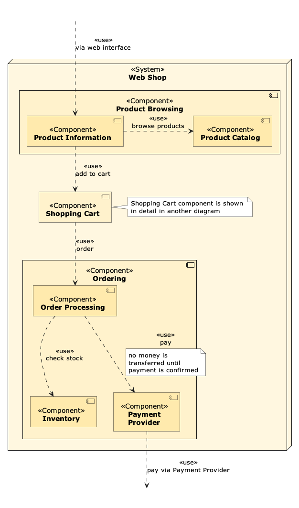
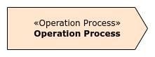
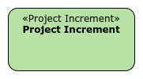
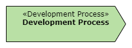

<!-- markdownlint-disable MD033 -->
# adf-plantuml <!-- omit in toc -->


ADF Elements and Relations with PlantUML

## Content <!-- omit in toc -->

- [Introduction](#introduction)
- [Examples and general notes](#examples-and-general-notes)
- [Table of Software@Runtime elements and relations](#table-of-softwareruntime-elements-and-relations)
  - [A note on UML sequence diagrams](#a-note-on-uml-sequence-diagrams)
- [Table of Software@Devtime elements and relations](#table-of-softwaredevtime-elements-and-relations)
  - [A note on UML class diagrams](#a-note-on-uml-class-diagrams)
- [Table of Environment@Runtime elements and relations](#table-of-environmentruntime-elements-and-relations)
- [Table of Environment@Devtime elements and relations](#table-of-environmentdevtime-elements-and-relations)
- [Footnote](#footnote)

## Introduction

[PlantUML](https://plantuml.com/) is a widely used framework that follows the "diagrams-as-code" principle: Instead of using some diagramming tool, you define a diagram using special commands and let the diagrams be generated for you. This is particularly suitable for smaller diagrams. On large diagrams, the PlantUML's autolayout algorithm does not always produce good results. However, it is often possible to tweak the results to some degree (see notes on the examples of the next section).

We've created [ADF.puml](ADF.puml), a PlantUML template which defines all ADF elements and relations to be used in PlantUML. Download the template and import it via `!include ADF.puml` into your diagram or use [this link](https://editor.plantuml.com/uml/SoWkIImgAStDuNBAJrBGjLDmpCbCJbMmKiX8pSd9vt98pKi1IW80) to get started right away in the PlantUML online editor.

In this document, we first give a few examples for ADF diagrams to illustrate some of the concepts. Then a comprehensive list of all elements and relations, along with usage instructions, is provided.

## Examples and general notes

Here is a simple example for a system-context-overview:


```plantumlcode
@startuml example1
!include ADF.puml

ADFRole(user, "User")
ADFRole(admin, "Administrator")

ADFSystem(ws, "Web Shop")
ADFExternalSystem(pp, "Payment Provider")

ADFRelation(admin, ws, "use", "configure,\ntroubleshoot")
ADFRelation(user, ws, "use", "register,\nbrowse,\nbuy")

pp -left0)- ws : "pay"
@enduml
```

Some notes:

- You have to import [ADF.puml](ADF.puml) which contains all configuration and custom ADF*-commands for the ADF elements and relations.
- The commands are realized via so called "unquoted procedures". Therefore, you do not have to use quotes for the parameters. A widely used convention is to use plain parameters for the IDs of the elements (`user`, `admin`, `ws`, `pp`) and quotes around names and labels (e.g. `"use"`, `"configure"`, `"pay"` and so on).
- PlantUML uses autolayout, which does not always produces optimal results. However, with only a little bit of experimentation, the layout can be improved drastically. In the above example, the order of the two roles was chosen deliberately to show the "normal" user role left to the admin role. Furthermore, the left instruction in the lollipop connector arranges the systems next to each other.

Here is another, more complicated example of a functional decomposition of the Web Shop system.



```plantumlcode
@startuml example1
!include ADF.puml

ADFInvisibleElement(web)

ADFSystem(ws, "Web Shop", 0) {
    ADFComponent(browsing, "Product Browsing") {
        ADFComponent(pi, "Product Information", 2)
        ADFComponent(prod, "Product Catalog", 2)
    }
    ADFComponent(cart, "Shopping Cart")
    note as cartnote
        Shopping Cart component is shown 
        in detail in another diagram
    end note
    cart - cartnote
    ADFComponent(ord, "Ordering") {
        ADFComponent(op, "Order Processing", 2)
        ADFComponent(inv, "Inventory", 2)
        ADFComponent(pp, "Payment**\n**Provider", 2)
    }
}

ADFInvisibleElement(ps)

ADFRelation(web, pi, "uses", "Web Browser")
ADFRelation(pi, prod, "uses", "browse products", "right")
ADFRelation(pi, cart, "uses", "add to cart")
ADFRelation(cart, op, "uses", "order")
ADFRelation(op, inv, "uses", "check stock")
ADFRelation(op, pp, "uses", "pay")
note on link
    no money is
    transferred until
    payment is confirmed
end note
ADFRelation(pp, ps, "uses", "pay via Payment Provider")

@enduml
```

Some noteworthy observations regarding this second example:

- You can nest elements. Since every component has the same default background color, there is an optional third "shade"-parameter to slightly change the color shade and make the diagrams more readable. A value of 1 is the default.
- If you want to wrap the name of a component (or any other element), you need to use `**\n**` as a line separator in order to maintain bold text in the name, which is illustrated in the "Payment Provider" component. This is a quirk due to the way the elements are defined.
- Sometimes, you want to illustrate at which points interaction from the outside of a system or component takes place without introducing more systems or components. To achieve this, a `ADFInvisibleElement` has been introduced (which is basically a transparent rectangle).
- Again, the single "right" instruction on the second ADFRelation has huge impact on the diagram layout. Also the order of the elements and relation can change the layout. It is a good start to experiment if the autolayout does not suit your needs.
- In this diagram, some notes have been added to demonstrate the usage of the note element. The second note has been placed directly on the "pay"-relation. Again, the layout changes a lot if you place the cartnote outside the component or even the system.

Our last example focuses on how to indicate provided and required interfaces.


```plantumlcode
@startuml example3
!include ../ADF.puml

ADFSystem(backend, "Weather Forecast")

() "provide weather forecast" as pwf
backend -up- pwf

backend ---(( "query historial data"
backend --(( query_forecast_data

label "query\nweather\nstation" as qws
backend -r-( qws
@enduml
```

Provided interfaces are defined with the `()` syntax.

For required interfaces, there are different possibilities:

- a succinct `-((` notation, which unfortunately does not support spaces when used without quotes and, when used with quotes, also prints the quotes on the diagram.
- a workaround of linking to a label, which looks better but sometimes is placed a bit off.

Note that the length of the required interface line has impact on the layout and readability of the diagram: `-(` versus `--(` versus `--(`.

## Table of Software@Runtime elements and relations

| Element     | Corresponding PlantUML procedure | Example Code |
| ----------- | -------------------------------- | ------------ |
|      | `ADFRole($id, $name)` | `ADFRole(u, "User")` |
|   | `ADFSystem($id, $name, $shade = 1)`, optional shade parameter in range {0, 1, 2, 3} with 1 being the default background color shade. | `ADFExternalSystem(b, "Backend")`, `ADFSystem(b, "Backend", 2)` |
|   | `ADFExternalSystem($id, $name, $shade = 1)`, `shade` as in `ADFSystem` | `ADFExternalSystem(iam, "IAM")`, `ADFExternalSystem(iam, "IAM", 2)` |
|   | `ADFLayer($id, $name, $shade = 1)`, `shade` as in `ADFSystem` | `ADFLayer(ld, "Data Layer")` (layer has no inside elements, hence, the label is inside the main layer box), `ADFLayer(ld, "Data Layer") {ADFComponent(r, "Repository", 2) }` with `ADFComponent(...` and `}` on a new line each (layer has an inside element, hence, the label is inside the layer label box) |
|   | `ADFCluster($id, $name, $shade = 1)`, `shade` as in `ADFSystem` | `ADFCluster(sh, "Shopping")` (cluster has no inside elements, hence, the label is inside the main cluster box), `ADFCluster(sh, "Shopping") { ADFComponent(sc, "Shopping Cart", 2) }` (layer has an inside element, hence, the label is inside the layer label box) |
|   | `ADFComponent($id, $name, $shade = 1)`,  `shade` as in `ADFSystem` | `ADFComponent(ic, "Image Converter")`|
|   | `-0)-` or `-(0-`, direction can be added after first dash | `backend -left0)- client : "/posts endpoint"` |
|   | `ADFInterfaceRT($id, $name, $shade = 1)`,  `shade` as in `ADFSystem` | `ADFInterfaceRT(p, "Printer")` |
|   | `element1 <-left[thickness=10]-> element2: Connector` | `backend <-left[thickness=10]-> client: Publish/Subscribe` |
|   | `ADFData($id, $name, $shade = 1)`, `shade` as in `ADFSystem` | `ADFData(user, "User")`; ADFData can take inner attributes, constructors and methods like the PlantUML class element. If you want to nest Data elements, use `ADFDataContainer($id, $name, $shade = 1)` for outer elements, e.g. `ADFDataContainer(u, "User", 0) { ADFData(a, "Address") }` |
|   | `ADFTechnology($id, $name)` | `ADFTechnology(mysql, "MySQL Database")` |
|   | `ADFRelation($from, $to, "use", $description = "", $direction = "")` with optional (but strongly recommended) description and direction (`"left"`, `"right"`, `"up"`, `"down"`) to control layouting. `ADFRelationTwoWay` (with same parameters) can be used for bidirectional relations. | `ADFRelation(frontend, backend, "use")`, `ADFRelation(userrole, system, "use", "register account", "d")` ("d" instead of "down", ... possible) |
|  | same as above, but with `"dataflow"` instead of `"use"`. | To briefly express bidirectional dataflow, use e.g. `ADFRelationTwoWay(checkout, payment, "dataflow", "Payment Request/Response")` |
|   |  `rectangle "System Scope" as SystemScope #line.dashed{ ... }` | put rectangle around the elements that are the scope of the system. |
|   | `note "text" as id` | `note "Some note" as n`; also see examples in first section for how to use notes on relations |
|   | `element - note`, `element -- note` (longer connection, layout direction possible) | `backend - note`, `backend -down- note` |

### A note on UML sequence diagrams

UML sequence diagrams are an excellent way to describe interaction of systems or components. Furthermore, since their layout naturally grows to the bottom, they can be rendered very well by PlantUML.

There is no need to import `ADF.puml` when using UML sequence diagrams in an architecture documentation.

Here is some example with a plain style that matches the other ADF diagrams and uses auto-activation, which makes writing sequence diagrams even faster.


```plantumlcode
@startuml example-sequence
!theme plain
autoactivate on

participant "User" as U
participant "Shopping Cart" as SC
participant "Inventory" as I
participant "Price Calculator" as PC

U -> SC : add smartphone
  SC -> I : check stock of smartphone
  return 25
  SC -> PC : check price
  return 399$
return success
@enduml
```

## Table of Software@Devtime elements and relations

| Element     | Corresponding PlantUML procedure | Example Code |
| ----------- | -------------------------------- | ------------ |
|   | `ADFModule($id, $name, $shade = 1)`, `shade` as in `ADFSystem` (but using green Devtime color shades) | `ADFModule(ep, "Event Processor")`, `ADFModule(ep, "Event Processor", 2)` |
|   | `ADFInterfaceDT($id, $name, $shade = 1)`, `shade` as in `ADFSystem` | `ADFInterfaceDT(rh, "Registration Handler")` |
|   | `ADFPackage($id, $name, $shade = 1)`, `shade` as in `ADFSystem` | `ADFPackage(b, "Business")` (package has no inside elements, hence, the label is inside the main package box), `ADFPackage(b, "Business") { ADFModule(us, "User Service", 2) }` (package has an inside element, hence, the label is inside the package label box) |
|   | `ADFDatatype($id, $name, $shade = 1)`, `shade` as in `ADFSystem` | `ADFDatatype(u, "User")`; ADFDatatype can take inner attributes, constructors and methods like the PlantUML class element |
|   | `ADFLibrary($id, $name, $shade = 1)`, `shade` as in `ADFSystem` | `ADFLibrary(ok, "okHTTP")` |
|   | `ADFTechnology($id, $name)` | `ADFTechnology(t, "Technology")`, `ADFTechnology(t, "Technology", 2)` |
|   | `ADFRelation($from, $to, "use", $description = "", $direction = "")` with optional (but strongly recommended) description and direction (`"left"`, `"right"`, `"up"`, `"down"`) to control layouting. `ADFRelationTwoWay` (with same parameters) can be used for bidirectional relations. | `ADFRelation(shopping, basket, "use")`, `ADFRelation(shopping, basket, "use", "add item", "d")` ("d" instead of "down", ... possible) |
|   |  same as above, but with `"refine"` instead of `"use"` | |
|   | Asscociation : `--` <br> Generalization: `--\|>`<br> Realization: `..\|>`<br> Composition: `*--` <br> Aggregation: `o--`| see PlantUML class diagramm documentation for many examples |
|   | `note "text" as id` | `note "Some note" as n`; also see examples in first section for how to use notes on relations |
|   | `element - note`, `element -- note` (longer connection, layout direction possible) | `backend - note`, `backend -down- note` |

### A note on UML class diagrams

An UML class diagram also expresses a Data@Devtime view on the system, which usually is already quite close to the implementation. There is no need to import `ADF.puml` when using UML class diagrams in an architecture documentation. However, to get a style matching the other ADF diagrams, you can use the following lines:

```plantumlcode
@startuml
!theme plain
skinparam classAttributeIconSize 0
skinparam classFontStyle bold
hide circle
hide empty members
hide empty methods

'further code
@enduml
```

## Table of Environment@Runtime elements and relations

| Element     | Corresponding PlantUML procedure | Example Code |
| ----------- | -------------------------------- | ------------ |
|   | `ADFComputingNode($id, $name, $shade = 1)`, `shade` as in `ADFSystem` (but using orange Environment@Runtime color shades) | `ADFComputingNode(ls, "Linux Server")`, `ADFComputingNode(ls, "Linux Server", 2)` |
|  | `ADFExecutionEnvironment($id, $name, $shade = 1)`, `shade` as in `ADFSystem` | `ADFExecutionEnvironment(jvm, "Java Virtual Machinge")` |
|  | `ADFDeploymentArtifact($id, $name, $shade = 1)`, `shade` as in `ADFSystem` | `ADFDeploymentArtifact(bwar, "backend.war")` |
|   | `ADFOperationProcess($id, $name, $shade = 1)`, `shade` as in `ADFSystem` | `ADFOperationProcess(us, "Update System")` |
|   | `ADFTechnology($id, $name)` | `ADFTechnology(m, "MySQL")` |
|   | `ADFThread($id, $name, $shade = 1)`, `shade` as in `ADFSystem` | `ADFThread(sc, "Scheduler")` |
|   | `ADFRole($id, $name)` | `ADFRole(so, "System Operator")` |
|   | `ADFOrganizationalUnit($id, $name, $shade = 1)`, `shade` as in `ADFSystem` | `ADFOrganizationalUnit(dev, "Development Team")` |
|  | `ADFRelation($from, $to, "operate", $description = "", $direction = "")` with optional (but strongly recommended) description and direction (`"left"`, `"right"`, `"up"`, `"down"`) to control layouting. `ADFRelationTwoWay` (with same parameters) can be used for bidirectional relations. | `ADFRelation(admin, server, "operate")`, `ADFRelation(admin, server, "operate", "evaluate log data", "d")` ("d" instead of "down", ... possible) |
|  | same as above, but with `"execute"` instead of `"operate"` | |
|  | same as above, but with `"deploy"` instead of `"operate"` | |
|  | same as above, but with `"own"` instead of `"operate"` | |
|  | same as above, but with `"manifest"` instead of `"operate"` | |
|   | `-->` (with optional layouting instructions) | `server -up-> admin` |
|   | `note "text" as id` | `note "Some note" as n`; also see examples in first section for how to use notes on relations |
|   | `element - note`, `element -- note` (longer connection, layout direction possible) | `backend - note`, `backend -down- note` |

## Table of Environment@Devtime elements and relations

| Element     | Corresponding PlantUML procedure | Example Code |
| ----------- | -------------------------------- | ------------ |
|   | `ADFRole($id, $name)` | `ADFRole(so, "System Operator")` |
|   | `ADFOrganizationalUnit($id, $name, $shade = 1)`, `shade` as in `ADFSystem` | `ADFOrganizationalUnit(dev, "Development Team")` |
|   | `ADFProjectIncrement($id, $name, $shade = 1)`, `shade` as in `ADFSystem` | `ADFProjectIncrement(pi, "Sprint 1")`, `ADFProjectIncrement(pi, "User registration features")` |
|  | `ADFDeploymentArtifact($id, $name, $shade = 1)`, `shade` as in `ADFSystem` | `ADFDeploymentArtifact(bwar, "backend.war")` |
|   | `ADFDevelopmentProcess($id, $name, $shade = 1)`, `shade` as in `ADFSystem` | `ADFDevelopmentProcess(dp, "Sprint")` |
|   | `ADFDevelopmentTool($id, $name, $shade = 1)`, `shade` as in `ADFSystem` | `ADFDevelopmentTool(dt, "Jenkins")` |
|   | `ADFTechnology($id, $name)` | `ADFTechnology(t, "Docker")` |
|   | `ADFRelation($from, $to, "use", $description = "", $direction = "")` with optional (but strongly recommended) description and direction (`"left"`, `"right"`, `"up"`, `"down"`) to control layouting.  `ADFRelationTwoWay` (with same parameters) can be used for bidirectional relations. | `ADFRelation(tool, process, "use")`, `ADFRelation(process, tool, "use", "build automation", "d")` ("d" instead of "down", ... possible) |
|  | same as above, but with `"own"` instead of `"use"` | |
|  | same as above, but with `"manifest"` instead of `"use"` | |
|   | `note "text" as id` | `note "Some note" as n`; also see examples in first section for how to use notes on relations |
|   | `element - note`, `element -- note` (longer connection, layout direction possible) | `tool - note`, `tool -down- note` |

## Footnote

This page was written by Johannes Schneider. You can use the [ADF.puml](ADF.puml) template under the [MIT license](./LICENSE) and this text here and the examples under the [CC BY-SA 4.0 license](https://creativecommons.org/licenses/by-sa/4.0/).

Some preliminary work was done 2024 by Yan-Chun Chang in her Bachelor's thesis with the (German) title "Wie gut eignen sich die textbasierte Diagrammerstellungssprache PlantUML zur Erstellung von Architektur-Diagrammen nach der ADF-Methode im Vergleich zur Erstellung mit Diagrams.net?" at HTWG Konstanz (University of Applied Science).
