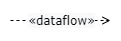

# ADF Elements and Relations with PlantUML <!-- omit in toc -->

## Content <!-- omit in toc -->

- [Introduction](#introduction)
- [Examples and general notes](#examples-and-general-notes)
- [Table of Software@Runtime elements and relations](#table-of-softwareruntime-elements-and-relations)
- [Table of Software@Devtime elements and relations](#table-of-softwaredevtime-elements-and-relations)
- [Table of Environment@Runtime elements and relations](#table-of-environmentruntime-elements-and-relations)
- [Table of Environment@Devtime elements and relations](#table-of-environmentdevtime-elements-and-relations)

## Introduction

PlantUML is a widely used framework that follows the "diagrams-as-code" principle: Instead of using some diagramming tool, you define a diagram using special commands and let the diagrams be generated for you. This is particularly suitable for smaller diagrams. On large diagrams, the PlantUML's autolayout algorithm does not always produce good results. However, it is often possible to tweak the results to some degree (see notes on the examples of the next section).

We've created [ADF.puml](ADF.puml), a PlantUML template which defines all ADF elements and relations to be used in PlantUML. Download the template and import it via `!include ADF.puml` into your diagram.

In this document, we first give two examples for ADF diagrams, illustrating some of the concepts. Then a detailed list of all elements and relations and how to use them follows.

## Examples and general notes

Here is a simple example for a system-context-overview:


```text
@startuml example1
!include ADF.puml

ADFRole(user, "User")
ADFRole(admin, "Administrator")

ADFSystem(ws, "Web Shop")
ADFExternalSystem(pp, "Payment Provider")

ADFRelation(admin, ws, "use", "configure,\ntroubleshoot")
ADFRelation(user, ws, "use", "register,\nbrowse,\nbuy")

pp -left0)- ws : "pay"
@enduml
```

Some notes:

- You have to import [ADF.puml](ADF.puml) which contains all configuration and custom ADF*-commands for the ADF elements and relations.
- The commands are realized via so called "unquoted procedures". Therefore, you do not have to use quotes for the parameters. A widely used convention is to use plain parameters for the IDs of the elements (`user`, `admin`, `ws`, `pp`) and quotes around names and labels (e.g. `"use"`, `"configure"`, `"pay"` and so on).
- PlantUML uses autolayout, which often produces less than optimal results. However, with only a little bit of experimentation, the layout can be improved drastically. In the above example, the order of the two roles was chosen deliberately to show the "normal" user role left to the admin role. Furthermore, the left instruction in the lollipop connector arranges the systems next to each other.

Here is another, more complicated example of a functional decomposition of the Web Shop system.


```text
@startuml example1
!include ADF.puml

ADFOutsidePort(web)

ADFSystem(ws, "Web Shop", 0) {
    ADFComponent(browsing, "Product Browsing") {
        ADFComponent(pi, "Product Information", 2)
        ADFComponent(prod, "Product Catalog", 2)
    }
    ADFComponent(cart, "Shopping Cart")
    note as cartnote
        Shopping Cart component is shown 
        in detail in another diagram
    end note
    cart - cartnote
    ADFComponent(ord, "Ordering") {
        ADFComponent(op, "Order Processing", 2)
        ADFComponent(inv, "Inventory", 2)
        ADFComponent(pp, "Payment Provider", 2)
    }
}

ADFOutsidePort(ps)

ADFRelation(web, pi, "uses", "Web Browser")
ADFRelation(pi, prod, "uses", "browse products", "right")
ADFRelation(pi, cart, "uses", "add to cart")
ADFRelation(cart, op, "uses", "order")
ADFRelation(op, inv, "uses", "check stock")
ADFRelation(op, pp, "uses", "pay")
note on link
    no money is
    transferred until
    payment is confirmed
end note
ADFRelation(pp, ps, "uses", "pay via Payment Provider")

@enduml
```

Some noteworthy observations regarding this second example:

- You can nest elements. Since every component has the same default background color, there is an optional third "shade"-parameter to slightly change the color shade and make the diagrams more readable. A value of 1 is the default.
- Sometimes, you want to illustrate at which points interaction from the outside of a system or component takes place without introducing more systems or components. To achieve this, a `ADFOutsidePort` has been introduced (which is basically a transparent rectangle).
- Again, the single "right" instruction on the second ADFRelation has huge impact on the diagram layout. Also the order of the elements and relation can change the layout. It is a good start to experiment if the autolayout does not suit your needs.
- In this diagram, some notes have been added to demonstrate the usage of the note element. The second note has been placed directly on the "pay"-relation. Again, the layout changes a lot if you place the cartnote outside the component or even the system.

## Table of Software@Runtime elements and relations

| Element     | Corresponding PlantUML procedure | Example Code |
| ----------- | -------------------------------- | ------------ |
|      | `ADFRole($id, $name)` | `ADFRole(u, "User")` |
|   | `ADFSystem($id, $name, $shade = 1)`, optional shade parameter in range {0, 1, 2, 3} with 1 being the default background color shade. | `ADFExternalSystem(b, "Backend")`, `ADFSystem(b, "Backend", 2)` |
|   | `ADFExternalSystem($id, $name, $shade = 1)`, `shade` as in `ADFSystem` | `ADFExternalSystem(iam, "IAM")`, `ADFExternalSystem(iam, "IAM", 2)` |
|   | `ADFLayer($id, $name, $shade = 1)`, `shade` as in `ADFSystem` | `ADFLayer(ld, "Data Layer")` (layer has no inside elements, hence, the label is inside the main layer box), `ADFLayer(ld, "Data Layer") {ADFComponent(r, "Repository", 2) }` with `ADFComponent(...` and `}` on a new line each (layer has an inside element, hence, the label is inside the layer label box) |
|   | `ADFCluster($id, $name, $shade = 1)`, `shade` as in `ADFSystem` | `ADFCluster(sh, "Shopping")` (cluster has no inside elements, hence, the label is inside the main cluster box), `ADFCluster(sh, "Shopping") { ADFComponent(sc, "Shopping Cart", 2) }` (layer has an inside element, hence, the label is inside the layer label box) |
|   | `ADFComponent($id, $name, $shade = 1)`,  `shade` as in `ADFSystem` | `ADFComponent(ic, "Image Converter")`|
|   | `-0)-` or `-(0-`, direction can be added after first dash | `backend -left0)- client : "/posts endpoint"` |
|   | `ADFInterface($id, $name, $shade = 1)`,  `shade` as in `ADFSystem` | `ADFInterface(p, "Printer")` |
|   | `element1 <-left[thickness=10]-> element2: Connector` | `backend <-left[thickness=10]-> client: Publish/Subscribe` |
|   | `ADFData($id, $name, $shade = 1)`, `shade` as in `ADFSystem` | `ADFData(user, "User")`; ADFData can take inner attributes, constructors and methods like the PlantUML class element |
|   | `ADFTechnology($id, $name)` | `ADFTechnology(mysql, "MySQL Database")` |
|   | `ADFRelation($from, $to, "use", $description = "", $direction = "")` with optional (but strongly recommended) description and direction (`"left"`, `"right"`, `"up"`, `"down"`) to control layouting | `ADFRelation(frontend, backend, "use")`, `ADFRelation(userrole, system, "use", "register account", "d")` ("d" instead of "down", ... possible) |
|  | same as above, but with `"dataflow"` instead of `"use"` | |
|   |  `rectangle "System Scope" as SystemScope #line.dashed{ ... }` | put rectangle around the elements that are the scope of the system. |
|   | `note "text" as id` | `note "Some note" as n`; also see examples in first section for how to use notes on relations |
|   | `element - note`, `element -- note` (longer connection, layout direction possible) | `backend - note`, `backend -down- note` |

## Table of Software@Devtime elements and relations

| Element     | Corresponding PlantUML procedure | Example Code |
| ----------- | -------------------------------- | ------------ |
|   | `ADFModule($id, $name, $shade = 1)`, `shade` as in `ADFSystem` (but using green Devtime color shades) | `ADFModule(ep, "Event Processor")`, `ADFModule(ep, "Event Processor", 2)` |
|   | `ADFInterface($id, $name, $shade = 1)`, `shade` as in `ADFSystem` | `ADFInterface(rh, "Registration Handler")` |
|   | `ADFPackage($id, $name, $shade = 1)`, `shade` as in `ADFSystem` | `ADFPackage(b, "Business")` (package has no inside elements, hence, the label is inside the main package box), `ADFPackage(b, "Business") { ADFModule(us, "User Service", 2) }` (package has an inside element, hence, the label is inside the package label box) |
|   | `ADFDatatype($id, $name, $shade = 1)`, `shade` as in `ADFSystem` | `ADFDatatype(u, "User")`; ADFDatatype can take inner attributes, constructors and methods like the PlantUML class element |
|   | `ADFLibrary($id, $name, $shade = 1)`, `shade` as in `ADFSystem` | `ADFLibrary(ok, "okHTTP")` |
|   | `ADFTechnology($id, $name)` | `ADFTechnology(t, "Technology")`, `ADFTechnology(t, "Technology", 2)` |
|   | `ADFRelation($from, $to, "use", $description = "", $direction = "")` with optional (but strongly recommended) description and direction (`"left"`, `"right"`, `"up"`, `"down"`) to control layouting | `ADFRelation(shopping, basket, "use")`, `ADFRelation(shopping, basket, "use", "add item", "d")` ("d" instead of "down", ... possible) |
|   |  same as above, but with `"refine"` instead of `"use"` | |
|   | Asscociation : `--` <br> Generalization: `--\|>`<br> Realization: `..\|>`<br> Composition: `*--` <br> Aggregation: `o--`| see PlantUML class diagramm documentation for many examples |
|   | `note "text" as id` | `note "Some note" as n`; also see examples in first section for how to use notes on relations |
|   | `element - note`, `element -- note` (longer connection, layout direction possible) | `backend - note`, `backend -down- note` |

## Table of Environment@Runtime elements and relations

| Element     | Corresponding PlantUML procedure | Example Code |
| ----------- | -------------------------------- | ------------ |
|   | `ADFComputingNode($id, $name, $shade = 1)`, `shade` as in `ADFSystem` (but using orange Environment@Runtime color shades) | `ADFComputingNode(ls, "Linux Server")`, `ADFComputingNode(ls, "Linux Server", 2)` |
|  | `ADFExecutionEnvironment($id, $name, $shade = 1)`, `shade` as in `ADFSystem` | `ADFExecutionEnvironment(jvm, "Java Virtual Machinge")` |
|  | `ADFDeploymentArtifact($id, $name, $shade = 1)`, `shade` as in `ADFSystem` | `ADFDeploymentArtifact(bwar, "backend.war")` |
|   | `ADFOperationProcess($id, $name, $shade = 1)`, `shade` as in `ADFSystem` | `ADFOperationProcess(us, "Update System")` |
|   | `ADFTechnology($id, $name)` | `ADFTechnology(m, "MySQL")` |
|   | `ADFThread($id, $name, $shade = 1)`, `shade` as in `ADFSystem` | `ADFThread(sc, "Scheduler")` |
|   | `ADFRole($id, $name)` | `ADFRole(so, "System Operator")` |
|   | `ADFOrganizationalUnit($id, $name, $shade = 1)`, `shade` as in `ADFSystem` | `ADFOrganizationalUnit(dev, "Development Team")` |
|  | `ADFRelation($from, $to, "operate", $description = "", $direction = "")` with optional (but strongly recommended) description and direction (`"left"`, `"right"`, `"up"`, `"down"`) to control layouting | `ADFRelation(admin, server, "operate")`, `ADFRelation(admin, server, "operate", "evaluate log data", "d")` ("d" instead of "down", ... possible) |
|  | same as above, but with `"execute"` instead of `"operate"` | |
|  | same as above, but with `"deploy"` instead of `"operate"` | |
|  | same as above, but with `"own"` instead of `"operate"` | |
|  | same as above, but with `"manifest"` instead of `"operate"` | |
|   | `-->` (with optional layouting instructions) | `server -up-> admin` |
|   | `note "text" as id` | `note "Some note" as n`; also see examples in first section for how to use notes on relations |
|   | `element - note`, `element -- note` (longer connection, layout direction possible) | `backend - note`, `backend -down- note` |

## Table of Environment@Devtime elements and relations

| Element     | Corresponding PlantUML procedure | Example Code |
| ----------- | -------------------------------- | ------------ |
|   | `ADFRole($id, $name)` | `ADFRole(so, "System Operator")` |
|   | `ADFOrganizationalUnit($id, $name, $shade = 1)`, `shade` as in `ADFSystem` | `ADFOrganizationalUnit(dev, "Development Team")` |
|   | `ADFProjectIncrement($id, $name, $shade = 1)`, `shade` as in `ADFSystem` | `ADFProjectIncrement(pi, "Sprint 1")`, `ADFProjectIncrement(pi, "User registration features")` |
|  | `ADFDeploymentArtifact($id, $name, $shade = 1)`, `shade` as in `ADFSystem` | `ADFDeploymentArtifact(bwar, "backend.war")` |
|   | `ADFDevelopmentProcess($id, $name, $shade = 1)`, `shade` as in `ADFSystem` | `ADFDevelopmentProcess(dp, "Sprint")` |
|   | `ADFDevelopmentTool($id, $name, $shade = 1)`, `shade` as in `ADFSystem` | `ADFDevelopmentTool(dt, "Jenkins")` |
|   | `ADFTechnology($id, $name)` | `ADFTechnology(t, "Docker")` |
|   | `ADFRelation($from, $to, "use", $description = "", $direction = "")` with optional (but strongly recommended) description and direction (`"left"`, `"right"`, `"up"`, `"down"`) to control layouting | `ADFRelation(tool, process, "use")`, `ADFRelation(process, tool, "use", "build automation", "d")` ("d" instead of "down", ... possible) |
|  | same as above, but with `"own"` instead of `"use"` | |
|  | same as above, but with `"manifest"` instead of `"use"` | |
|   | `note "text" as id` | `note "Some note" as n`; also see examples in first section for how to use notes on relations |
|   | `element - note`, `element -- note` (longer connection, layout direction possible) | `tool - note`, `tool -down- note` |
